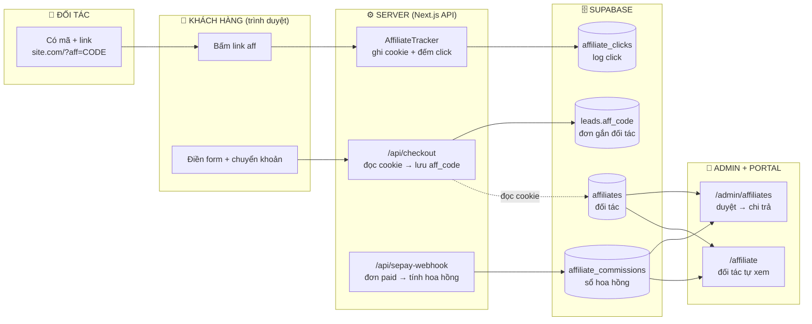
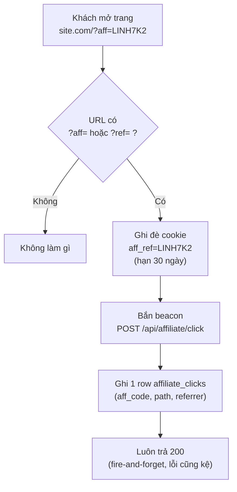
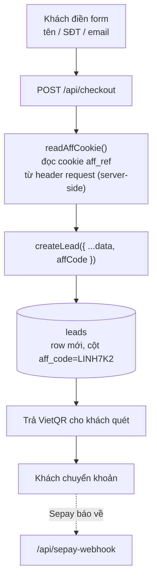
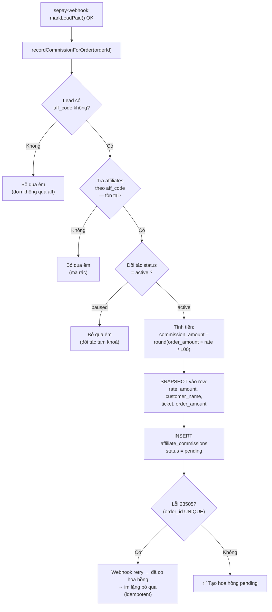
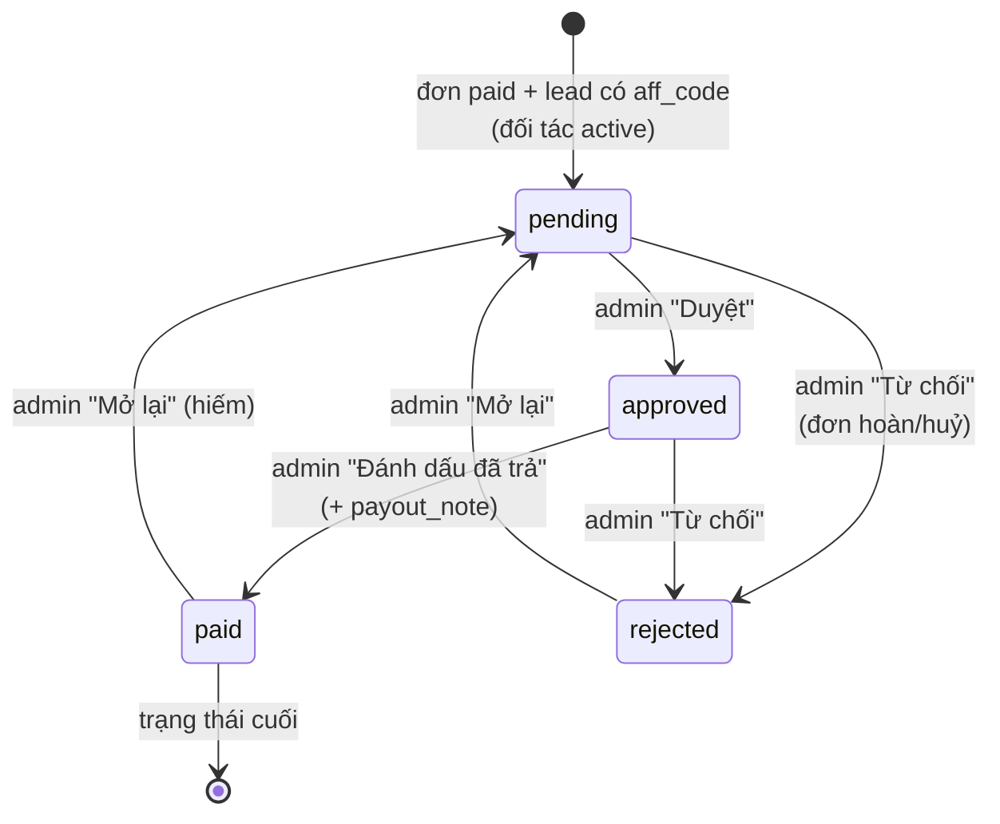
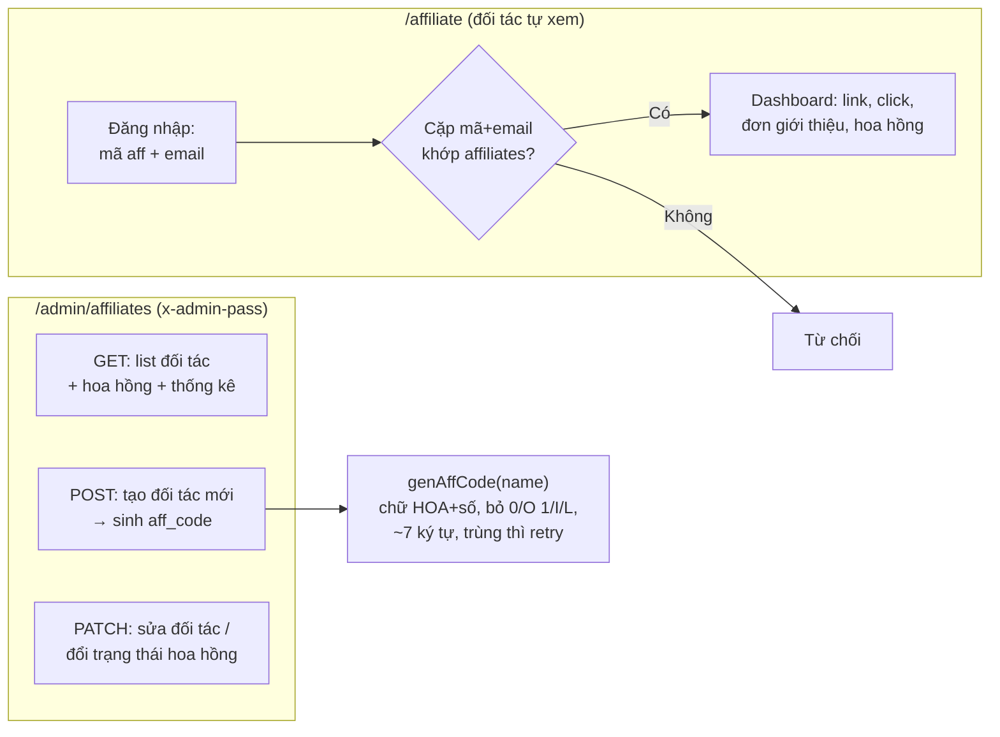
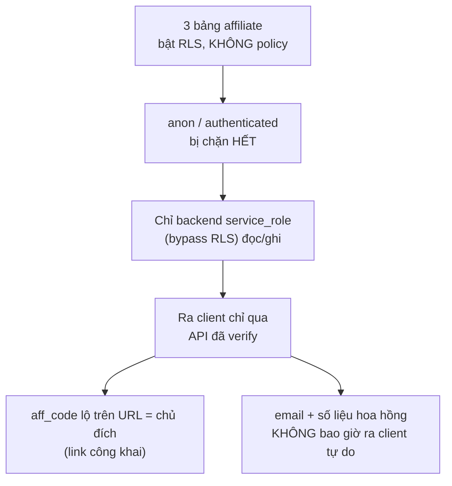

# Sơ đồ thuật toán: Hệ thống Affiliate (tiếp thị liên kết)

> Tài liệu này giải thích **cách hệ thống affiliate gán đơn cho đối tác và tính hoa hồng** — từ lúc khách bấm link `?aff=CODE` cho tới lúc admin chi trả tiền cho đối tác. Viết cho người mới, từ dễ đến khó. Logic lấy từ skill `/biz-affiliate-system`.

---

## 1. Hiểu nhanh trong 30 giây

Affiliate = cho người khác (đối tác / cộng tác viên) đi giới thiệu khách, ai giới thiệu ra đơn thì được chia % hoa hồng.

Hệ thống chỉ cần làm đúng **4 việc**:

1. **Gán đơn đáng tin** — khách bấm link `?aff=LINH7K2` → ghi cookie 30 ngày → đơn nào về sau cũng "dán nhãn" đối tác đó.
2. **Hoa hồng là bản ghi tài chính** — mỗi đơn đã thanh toán sinh **1 dòng hoa hồng bất biến**, chụp ảnh (snapshot) số tiền + % tại thời điểm bán, không bao giờ hết hạn.
3. **Idempotent** — ngân hàng/Sepay gọi webhook lại nhiều lần cũng **không** tạo hoa hồng trùng.
4. **Đối tác tự phục vụ** — có portal riêng để đối tác tự xem click / đơn / hoa hồng, đỡ phải hỏi admin.

> 💡 **Quy tắc vàng:** "Cookie quyết định ai được tính công; database quyết định trả bao nhiêu."

---

## 2. Sơ đồ tổng quan — 5 nhân vật

---

## 3. Luồng 1 — Khách bấm link aff (gán nhãn last-touch)

`AffiliateTracker` (client component gắn trong `layout.tsx`) chạy trên **mọi trang**. Mỗi lần thấy `?aff=` trên URL → ghi đè cookie. Đối tác giới thiệu **gần nhất** được tính công (last-touch).

> ⚠️ **Click không cần mã đúng**: bảng `affiliate_clicks` **không** có khoá ngoại tới `affiliates`. Khách gõ link sai mã vẫn ghi log; lúc portal hiển thị thì query lọc đúng `aff_code` của đối tác thật nên rác tự ẩn.

---

## 4. Luồng 2 — Khách điền form & chuyển khoản (gắn đơn)

Mấu chốt: **không sửa form đăng ký**. Có nhiều form rải rác khắp các trang — patch hết thì mong manh. Thay vào đó **server đọc cookie `aff_ref`** lúc tạo đơn, nên mọi form tự động kèm aff.

---

## 5. Luồng 3 — Đơn paid → sinh hoa hồng (trái tim hệ thống)

Sau khi `markLeadPaid()` thành công, webhook gọi `recordCommissionForOrder(orderId)`. Hàm này được bọc `try/catch` — **hoa hồng lỗi KHÔNG được làm fail việc xác nhận thanh toán** (nếu không Sepay sẽ retry → phiền).

**Hai bảo hiểm quan trọng đứng cạnh nhau ở đây:**

| Cơ chế | Vì sao | Cách làm |
|---|---|---|
| **Idempotent** | Sepay retry webhook song song | `order_id` UNIQUE + bắt lỗi `23505` ở tầng DB (chắc hơn check-then-insert vì có race) |
| **Snapshot** | Sau này admin đổi % của đối tác, hoặc `leads` hết TTL 90 ngày bị xoá | Chụp cứng rate + số tiền + tên + sản phẩm vào row hoa hồng → đọc độc lập như sổ kế toán |

---

## 6. Vòng đời một bản ghi hoa hồng (state machine)

- **pending** — tạo tự động khi đơn paid. Đối tác `paused` thì **không** tạo.
- **approved** — admin đã đối soát, hợp lệ, chờ kỳ chi trả.
- **paid** — đã chuyển tiền, có `payout_note` (vd "CK Vietcombank 01/06").
- **rejected** — KHÔNG tính vào tổng hoa hồng / doanh thu / số đơn.

> 💡 `leads` có pg_cron tự xoá sau 90 ngày, nhưng `affiliate_commissions` **không bao giờ TTL** — nó là sổ sách tài chính.

---

## 7. Luồng 4 — Admin quản trị & Portal đối tác

**Portal đăng nhập đơn giản có chủ đích**: mã aff vốn công khai trên link, nên **email** đóng vai "lớp khoá" cơ bản — đủ cho quy mô landing page, không cần mật khẩu riêng.

---

## 8. Bảo mật & quy ước cần nhớ

- **Last-touch**: mỗi `?aff=` mới ghi đè cookie → đối tác giới thiệu sau cùng được công.
- **aff_code an URL**: chữ HOA + số, bỏ ký tự dễ nhầm (`0/O`, `1/I/L`), độ dài ~7.
- **Hoa hồng = sổ kế toán**: không TTL, snapshot bất biến, `order_id` UNIQUE.
- **Tiền VND**: format có chấm phân cách nghìn, vd `1.286.800đ`.

---

## 9. Tóm tắt 1 dòng cho mỗi mảnh

| Mảnh | Việc duy nhất nó làm |
|---|---|
| `AffiliateTracker` (layout) | Thấy `?aff=` → ghi cookie 30 ngày + bắn beacon đếm click |
| `/api/affiliate/click` | Nhận beacon, ghi `affiliate_clicks`, luôn trả 200 |
| `/api/checkout` (patch) | Đọc cookie `aff_ref` server-side → lưu `leads.aff_code` |
| `/api/sepay-webhook` (patch) | Đơn paid → `recordCommissionForOrder()` (try/catch) |
| `recordCommissionForOrder()` | Tra đối tác → tính tiền → snapshot → insert pending (idempotent) |
| `/admin/affiliates` | Tạo/sửa đối tác + duyệt → chi trả hoa hồng |
| `/affiliate` | Đối tác đăng nhập (mã+email) → tự xem số liệu |
