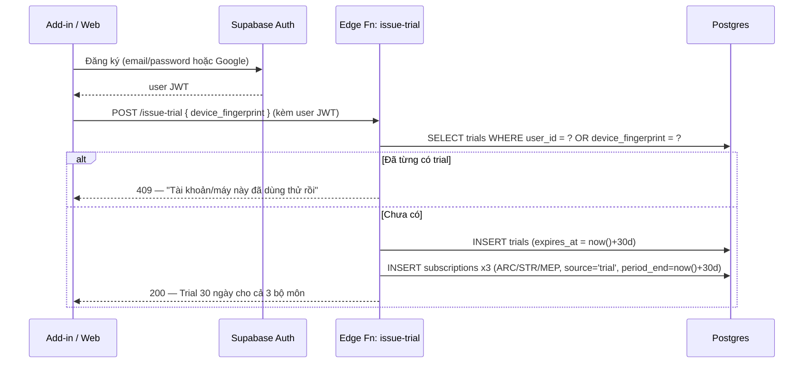
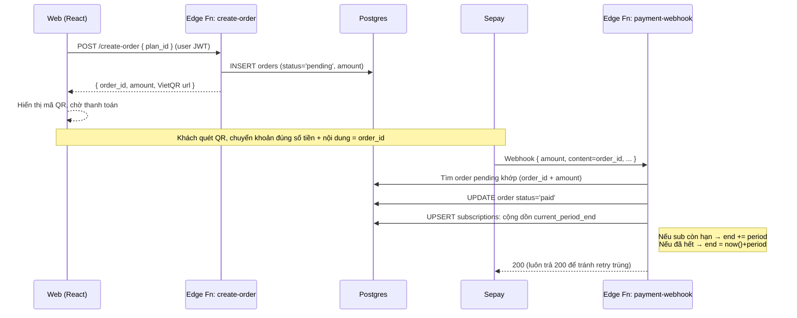
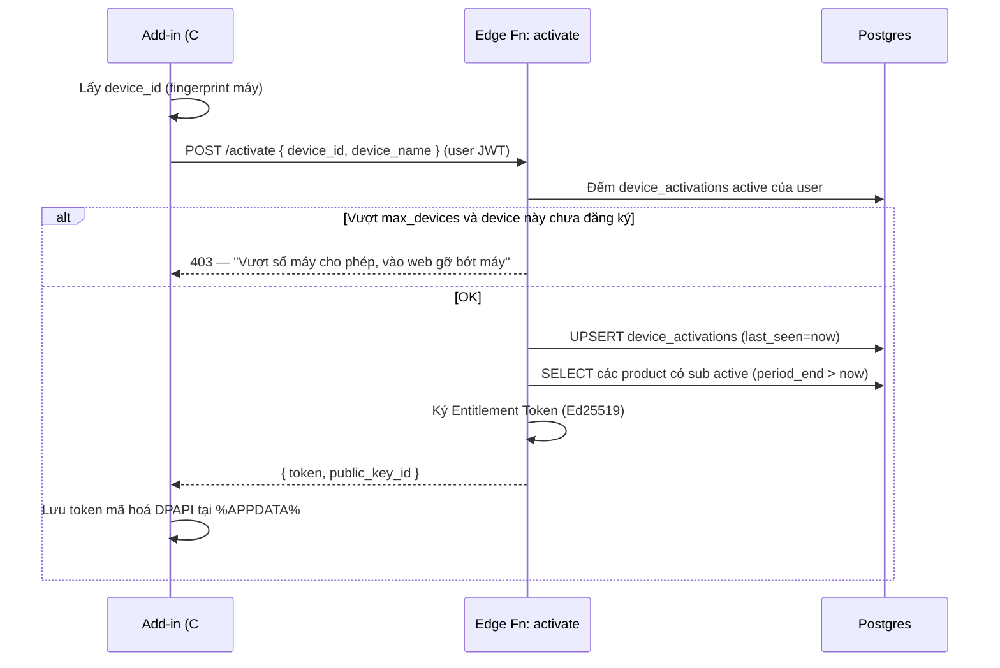
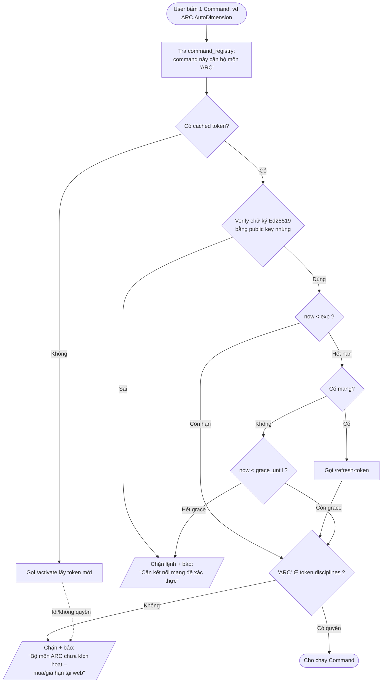
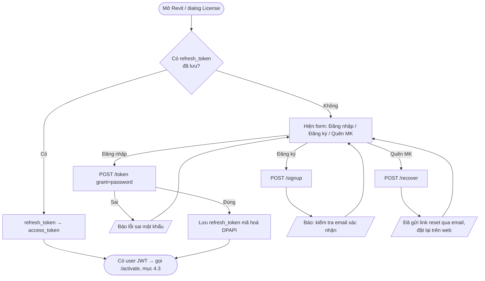
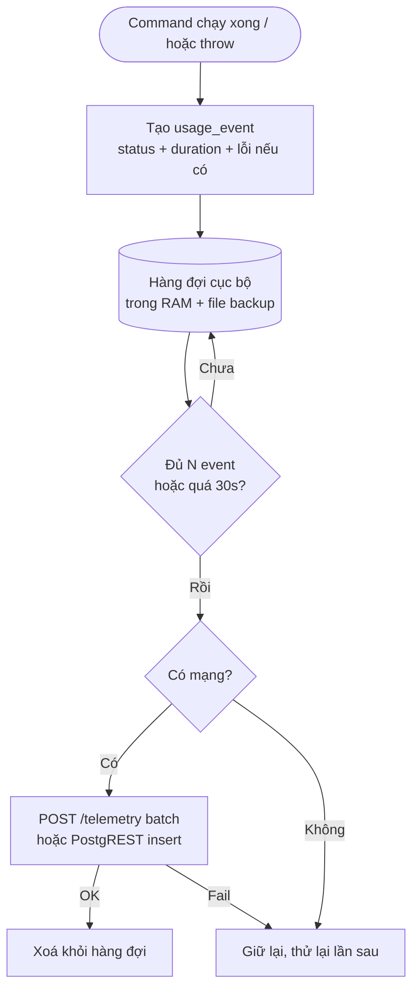
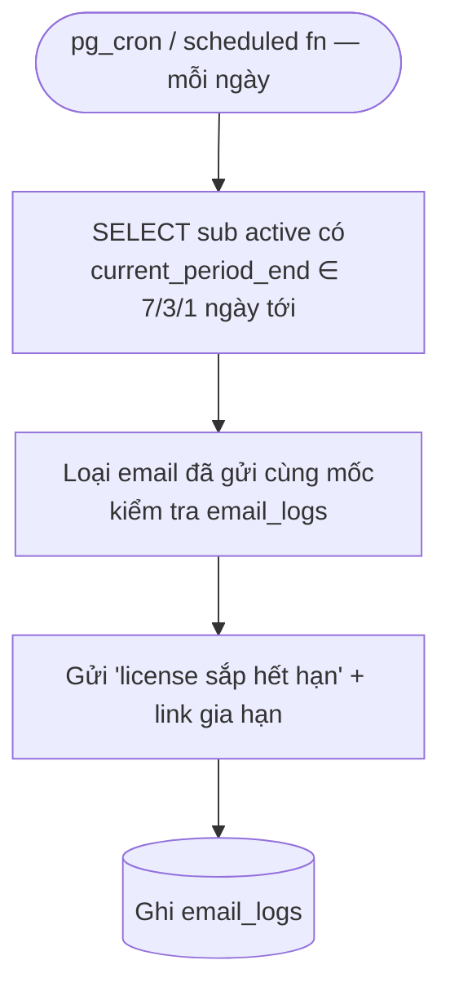
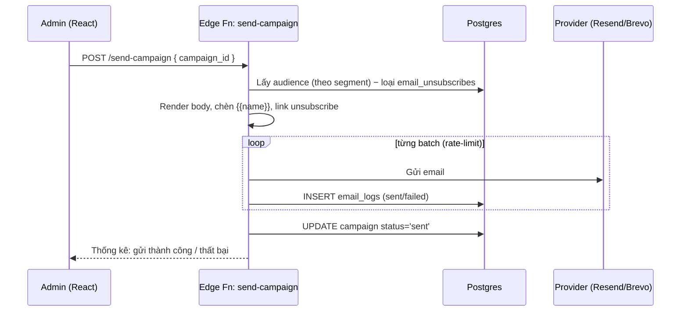

# Sơ đồ thuật toán & công nghệ — Hệ thống License Revit Add-in (Subscription)

> Tài liệu thiết kế cho sản phẩm: **Revit API Add-in 3 bộ môn** — Kiến trúc (ARC) · Kết cấu (STR) · Điện nước/MEP (MEP).
> Mô hình kinh doanh: **subscription theo từng bộ môn hoặc combo**, có **trial tự động 1 tháng** cho user mới.
> Stack: **ReactJS + Supabase** (web + backend) · **C#/.NET Revit Add-in** gọi HTTP tới API kiểm tra quyền.

---

## 1. Tổng quan kiến trúc

```
┌──────────────────────────┐         ┌───────────────────────────────────────────┐
│  REVIT (máy người dùng)   │         │                 SUPABASE                    │
│                          │         │                                             │
│  Add-in C#/.NET          │         │  ┌─────────────┐   ┌──────────────────────┐ │
│  ┌────────────────────┐  │  HTTPS  │  │ Auth (JWT)  │   │  Postgres + RLS       │ │
│  │ LicenseClient      │──┼────────►│  │ user accounts│  │  profiles / products  │ │
│  │  - device id       │  │         │  └─────────────┘   │  subscriptions        │ │
│  │  - cached token    │◄─┼─────────│  ┌─────────────┐   │  device_activations   │ │
│  │  - verify offline  │  │  token  │  │ Edge Funcs  │──►│  orders / payments    │ │
│  └────────────────────┘  │         │  │ (Deno/TS)   │   │  trials / check_logs  │ │
│  Mỗi Command gọi         │         │  │ - activate  │   └──────────────────────┘ │
│  CanRun(discipline)?     │         │  │ - check     │                            │
└──────────────────────────┘         │  │ - webhook   │   ┌──────────────────────┐ │
                                      │  │ - issue-trial│  │  Storage (file .msi/  │ │
┌──────────────────────────┐         │  └─────────────┘   │  bản cài add-in)      │ │
│  WEB (ReactJS + Vite)     │  HTTPS  │        ▲           └──────────────────────┘ │
│  - Landing/bán hàng       │────────►│        │                                    │
│  - Đăng nhập / Dashboard  │         └────────┼────────────────────────────────────┘
│  - Quản lý subscription   │                  │
│  - Quản lý thiết bị       │            ┌──────┴──────┐
│  - Admin                  │            │  Sepay      │  (VietQR webhook khi khách
└──────────────────────────┘            │  / PayOS    │   chuyển khoản thành công)
                                         └─────────────┘
```

**Nguyên tắc lõi:** Add-in **không** giữ secret để cấp quyền. Server (Edge Function) ký một **entitlement token** ngắn hạn; add-in chỉ cần **public key** để verify offline. Nhờ vậy:
- Mỗi command **không phải gọi mạng** (verify chữ ký cục bộ) → nhanh, không lag Revit.
- Vẫn an toàn: token hết hạn nhanh, server kiểm soát được thu hồi (refund/chargeback).
- Chạy được **offline** trong thời gian grace.

---

## 2. Công nghệ sử dụng

| Lớp | Công nghệ | Vai trò |
|---|---|---|
| Web frontend | **ReactJS (Vite) + TypeScript + TailwindCSS** | Landing bán hàng, đăng nhập, dashboard quản lý sub/thiết bị, trang admin |
| | **@supabase/supabase-js** | Auth + query Postgres trực tiếp (qua RLS) |
| Auth | **Supabase Auth** | Email/password + Google OAuth. Phát JWT user. |
| Database | **Supabase Postgres + Row Level Security** | Toàn bộ dữ liệu nghiệp vụ |
| API nghiệp vụ | **Supabase Edge Functions (Deno/TypeScript)** | `activate`, `check-entitlement`, `issue-trial`, `payment-webhook`, `refresh-token` |
| Ký token | **Ed25519 (hoặc RS256)** — private key trong Edge Function secret, public key nhúng trong add-in | Ký & verify entitlement token offline |
| Thanh toán | **Sepay VietQR** (khuyến nghị cho VN) hoặc PayOS/Casso | Nhận chuyển khoản → webhook → kích hoạt/gia hạn sub |
| Lưu file cài | **Supabase Storage** | Bản cài `.msi`/`.addin`, signed URL cho khách đã mua |
| Revit Add-in | **C# / .NET (Revit API), `HttpClient`** | Gọi `activate`, cache token, verify Ed25519 cục bộ mỗi command |
| Lưu cache cục bộ | File JSON mã hoá (DPAPI) tại `%APPDATA%` | Token + device id, chống sửa tay |

**Vì sao manual-renewal thay vì auto-recurring?** Thẻ VN/chuyển khoản hầu như không hỗ trợ trừ tiền định kỳ. Mô hình: khách chủ động gia hạn bằng VietQR, hệ thống **cộng dồn** `current_period_end` và gửi email/nhắc trước khi hết hạn 7 ngày. Đơn giản, đúng thị trường, ít rủi ro hoàn tiền.

---

## 3. Mô hình dữ liệu (Postgres)

```sql
-- Người dùng (mở rộng auth.users)
profiles (
  id uuid pk → auth.users.id,
  full_name text, phone text, company text,
  created_at timestamptz
)

-- Bộ môn / sản phẩm con
products (
  code text pk,            -- 'ARC' | 'STR' | 'MEP'
  name text,               -- 'Kiến trúc' ...
  is_active bool
)

-- Gói bán (đơn lẻ + combo) — combo trỏ tới nhiều product qua plan_products
plans (
  id uuid pk,
  code text unique,        -- 'ARC_M','ARC_Y','COMBO_Y'...
  name text,
  period text,             -- 'month' | 'year'
  price_vnd int,           -- 200000 / 2000000 ...
  is_combo bool,
  is_active bool
)
plan_products ( plan_id uuid, product_code text )  -- gói này phủ bộ môn nào

-- Subscription: 1 dòng cho mỗi quyền bộ môn đang hiệu lực của user
subscriptions (
  id uuid pk,
  user_id uuid,
  product_code text,       -- ARC/STR/MEP  (combo = 3 dòng)
  source text,             -- 'trial' | 'paid'
  status text,             -- 'active' | 'expired' | 'canceled'
  current_period_end timestamptz,   -- mốc hết hạn (đã cộng dồn gia hạn)
  max_devices int default 2,
  created_at, updated_at
)

-- Thiết bị đã kích hoạt (giới hạn seat)
device_activations (
  id uuid pk,
  user_id uuid,
  device_id text,          -- fingerprint máy
  device_name text,        -- tên máy / Revit version
  last_seen_at timestamptz,
  status text,             -- 'active' | 'revoked'
  unique(user_id, device_id)
)

-- Trial đã cấp (chống lạm dụng)
trials (
  id uuid pk,
  user_id uuid unique,
  device_fingerprint text, -- chặn tạo nhiều account trên cùng máy
  granted_at, expires_at
)

-- Đơn hàng & thanh toán
orders (
  id text pk,              -- 'DH000123'
  user_id uuid,
  plan_id uuid,
  amount_vnd int,
  status text,             -- 'pending' | 'paid' | 'expired'
  created_at, paid_at
)
payments ( order_id text, gateway text, raw jsonb, received_at )

-- Đăng ký lệnh ↔ bộ môn (để add-in/biết command nào cần quyền gì)
command_registry (
  command_id text pk,      -- 'ARC.AutoDimension'
  product_code text,       -- 'ARC'
  min_version text
)

-- Log kiểm tra quyền (audit + phát hiện gian lận)
check_logs ( user_id, device_id, command_id, result, at )

-- Thu hồi token khẩn (refund/chargeback) — server check khi refresh
revoked_devices ( device_id text, reason text, at )
```

**Quyền (entitlement) là dữ liệu suy ra:** user X có quyền bộ môn `P` tại thời điểm `T` ⇔ tồn tại `subscriptions(user=X, product=P, status='active', current_period_end > T)`.

---

## 4. Các luồng thuật toán

### 4.1. Đăng ký + cấp Trial tự động (1 tháng)



Chống lạm dụng trial: khoá theo **cả `user_id` lẫn `device_fingerprint`** — tạo account mới trên cùng máy vẫn bị từ chối.

---

### 4.2. Mua / Gia hạn subscription (VietQR)



**Quy tắc cộng dồn gia hạn (idempotent theo order_id để webhook trùng không cộng 2 lần):**
```
base = max(now(), current_period_end_hiện_tại)
current_period_end = base + (1 tháng nếu period='month' | 1 năm nếu 'year')
status = 'active'
```
Combo → áp dụng cho cả 3 product_code trong `plan_products`.

---

### 4.3. Kích hoạt thiết bị (Activation) — chạy 1 lần khi mở Revit / đăng nhập add-in



**Entitlement Token (JWT ký Ed25519):**
```json
{
  "sub": "user-uuid",
  "device": "device-id",
  "disciplines": ["ARC", "STR"],   // chỉ bộ môn đang active
  "plan": "combo",
  "iat": 1718800000,
  "exp": 1718886400,               // ngắn: 24h
  "grace_until": 1719404800,       // cho phép offline tới 7 ngày
  "jti": "..."
}
```

---

### 4.4. Kiểm tra quyền MỖI khi chạy Command (lõi của hệ thống)

Đây là phần anh quan tâm nhất. Em thiết kế **hybrid**: ưu tiên verify cục bộ (nhanh, offline), chỉ gọi mạng khi cần refresh.



**Pseudo-code phía add-in (C#):**
```
bool CanRun(string commandId):
    product = Registry.RequiredProduct(commandId)        // 'ARC'
    token   = Cache.Load()                                // có thể null
    if token == null: token = Server.Activate()          // gọi mạng 1 lần
    if !Crypto.VerifyEd25519(token, PublicKey): return Deny("token lỗi")

    if Now < token.exp:
        // còn hạn → check offline, không gọi mạng
        return token.disciplines.Contains(product) ? Allow : Deny("chưa kích hoạt")

    // token hết hạn → thử refresh
    if Network.Available:
        token = Server.Refresh(token)                    // server check revoked + sub
        Cache.Save(token)
        return token.disciplines.Contains(product) ? Allow : Deny()
    else:
        // offline → cho phép trong grace
        if Now < token.grace_until:
            return token.disciplines.Contains(product) ? Allow : Deny()
        return Deny("Cần kết nối mạng để xác thực lại")
```

> **Lưu ý hiệu năng:** verify Ed25519 cục bộ tốn ~micro giây → gọi mỗi command thoải mái, không lag Revit. Token TTL 24h nghĩa là tối đa 1 lần gọi mạng/ngày/máy. Nếu anh muốn **chặt hơn** (chặn ngay khi refund), giảm `exp` xuống 1–4h.

**Tuỳ chọn online thuần** (nếu anh muốn API gọi mỗi command đúng nghĩa): thêm endpoint `POST /check-entitlement { device_id, command_id }` trả `{ allowed, reason }`. Nhược điểm: phụ thuộc mạng, lag nếu mạng chậm, tốn quota Edge Function. **Khuyến nghị dùng hybrid ở trên**, chỉ fallback online khi token hết hạn.

---

### 4.5. Vòng đời subscription

```
trial(30d) ──hết hạn──► expired ──mua──► active ──gần hết hạn(7d)──► email nhắc
   │                                        │
   └──────────── mua trong lúc trial ───────┘ (cộng dồn)
active ──hết hạn không gia hạn──► expired (token refresh sẽ loại bộ môn đó)
active ──refund/chargeback──► thêm device vào revoked_devices → refresh bị chặn
```

Job định kỳ (pg_cron hoặc Vercel/Supabase scheduled function):
- Mỗi ngày: `UPDATE subscriptions SET status='expired' WHERE current_period_end < now()`.
- Gửi email nhắc gia hạn cho sub sắp hết hạn trong 7 ngày.

---

## 5. Danh sách API (Edge Functions)

| Endpoint | Method | Auth | Vai trò |
|---|---|---|---|
| `/issue-trial` | POST | user JWT | Cấp trial 30 ngày cho user/máy mới |
| `/activate` | POST | user JWT | Đăng ký thiết bị + phát entitlement token |
| `/refresh-token` | POST | user JWT (hoặc token cũ) | Cấp lại token, kiểm tra revoked + sub mới nhất |
| `/check-entitlement` | POST | user JWT | (tuỳ chọn) check online thuần theo command |
| `/create-order` | POST | user JWT | Tạo đơn + trả VietQR |
| `/payment-webhook` | POST | secret từ Sepay | Nhận thanh toán → kích hoạt/gia hạn (idempotent) |
| `/devices` (list/revoke) | GET/POST | user JWT | Web: xem & gỡ thiết bị |

Web React đọc dữ liệu hiển thị (sub, đơn, thiết bị) **trực tiếp qua supabase-js + RLS**; chỉ thao tác nhạy cảm (cấp quyền, ký token, webhook) mới đi qua Edge Function.

---

## 6. Bảo mật & chống crack

1. **Ký bất đối xứng (Ed25519/RS256):** private key chỉ nằm trong Edge Function secret; add-in chỉ có public key → kẻ gian không tự ký token giả được.
2. **Token ngắn hạn + grace:** cân bằng giữa chống lạm dụng và chạy offline. Thu hồi qua `revoked_devices` + giảm TTL.
3. **Device binding + seat limit:** mỗi sub giới hạn `max_devices`; vượt thì phải gỡ máy cũ trên web.
4. **RLS deny-by-default:** user chỉ đọc được dữ liệu của chính mình; bảng nhạy cảm (subscriptions ghi, payments) chỉ Edge Function (service role) được ghi.
5. **Webhook idempotent:** dedupe theo `order_id`, luôn trả 200 để Sepay không retry gây cộng tiền 2 lần.
6. **Chống sửa cache:** file token cục bộ mã hoá DPAPI (gắn theo user Windows), sửa tay → verify fail.
7. **Audit:** `check_logs` phát hiện 1 device chạy bất thường nhiều máy / nhiều account.

> Lưu ý thực tế: không có DRM nào chống crack 100% với add-in .NET (có thể bị decompile). Mục tiêu là **nâng chi phí crack cao hơn giá mua** + giữ trải nghiệm tốt cho khách thật. Có thể bổ sung obfuscation (ConfuserEx/Dotfuscator) cho phần verify.

---

## 7. Tích hợp phía Revit Add-in (C#)

- **device_id (fingerprint):** hash từ `MachineGuid` (registry) + CPU id + Windows SID → ổn định, không lộ thông tin nhạy cảm.
- **Mỗi `IExternalCommand`** gắn attribute khai báo bộ môn, vd:
  ```csharp
  [RequiresProduct("ARC")]
  public class AutoDimensionCommand : IExternalCommand {
      public Result Execute(...) {
          if (!License.CanRun("ARC.AutoDimension"))
              return ShowUpsell();   // popup mời mua/gia hạn + link web
          // ... logic thật
      }
  }
  ```
- **`LicenseClient`** singleton: load token lúc Revit khởi động (`IExternalApplication.OnStartup`), cache trong RAM + file, refresh nền khi gần hết hạn.
- **Trải nghiệm offline:** trong grace vẫn chạy, hiện banner "còn N ngày offline".
- **HTTP:** `HttpClient` tái sử dụng (static), timeout ngắn (3–5s), không block UI Revit — gọi async khi cần mạng.

---

## 8. Thứ tự triển khai đề xuất

1. **DB schema + RLS** trên Supabase (mục 3).
2. **Edge Functions** `issue-trial`, `activate`, `refresh-token` + ký Ed25519 (mục 5).
3. **Add-in C#**: device id, `LicenseClient`, verify offline, `CanRun()` (mục 7).
4. **Thanh toán**: `create-order` + `payment-webhook` Sepay, logic cộng dồn (mục 4.2).
5. **Auth trong Revit** (mục 9): login/register/forgot password ngay trong add-in.
6. **Telemetry** (mục 10): log usage + lỗi mỗi lần chạy command, dashboard thống kê.
7. **Web React**: đăng nhập, dashboard sub/thiết bị, trang mua + QR, admin.
8. **Email engine** (mục 11): quên mật khẩu, xác nhận mua, nhắc hết hạn, campaign.
9. **Landing bán hàng** (có thể tái dùng pipeline `/ui-ux-pro-max` trong repo này).
10. **Job định kỳ** hết hạn + email nhắc gia hạn + rollup thống kê.
11. **Hardening**: obfuscation, audit log, giảm TTL nếu cần chặt.

---

## 9. Đăng nhập / Đăng ký / Quên mật khẩu — ngay trong Revit

Add-in mở một **dialog WPF** (trong Revit) gọi thẳng **Supabase Auth REST (GoTrue)** bằng `anon key` qua HTTPS — không cần web.

| Hành động | Endpoint GoTrue | Kết quả |
|---|---|---|
| Đăng ký | `POST /auth/v1/signup` | Tạo user, Supabase gửi **email xác nhận** (mục 11) |
| Đăng nhập | `POST /auth/v1/token?grant_type=password` | Trả `access_token` (user JWT) + `refresh_token` |
| Làm mới phiên | `POST /auth/v1/token?grant_type=refresh_token` | Gia hạn access_token không bắt nhập lại mật khẩu |
| Quên mật khẩu | `POST /auth/v1/recover` | Supabase gửi **email reset**; user bấm link → đổi mật khẩu **trên web** |

> Quên mật khẩu: add-in chỉ **kích hoạt gửi email** (`/recover`). Việc đặt lại mật khẩu thực hiện qua link trong email → trang web `/reset-password` (React) gọi `supabase.auth.updateUser({ password })`. Không nên cho đổi mật khẩu trực tiếp trong Revit vì cần xác thực link an toàn.



**Lưu ý:** sau khi có `access_token` (user JWT) ở mọi luồng, add-in tiếp tục `/activate` để lấy entitlement token (mục 4.3) → vào kiểm tra quyền command (mục 4.4). `refresh_token` lưu mã hoá DPAPI để lần sau mở Revit không phải đăng nhập lại.

---

## 10. Telemetry — thống kê usage & log lỗi

Mục tiêu: (a) biết **add-in/tool nào được dùng nhiều nhất** toàn hệ thống; (b) **log mọi lần chạy** thành công/thất bại để debug lỗi thực địa.

### 10.1. Bảng dữ liệu (bổ sung mục 3)

```sql
usage_events (
  id bigint pk,
  user_id uuid,
  device_id text,
  session_id text,          -- 1 phiên mở Revit
  command_id text,          -- 'STR.ColumnRebar' | 'STR.BeamRebar' | 'ARC.WallDimension'
  product_code text,        -- ARC/STR/MEP
  status text,              -- 'success' | 'error' | 'denied'
  duration_ms int,          -- thời gian chạy lệnh
  revit_version text,       -- '2024'
  app_version text,         -- version add-in
  error_code text,          -- null nếu success
  error_message text,
  stack_trace text,         -- chỉ ghi khi error
  started_at timestamptz,
  created_at timestamptz default now()
)
-- index: (command_id, started_at), (user_id, started_at), (status)

-- Rollup ngày (materialized view, pg_cron refresh mỗi đêm) → dashboard nhanh
mv_tool_daily (
  day date, command_id text, product_code text,
  runs int, success int, errors int, denied int, unique_users int
)
```

### 10.2. Cơ chế gửi (fire-and-forget, không lag Revit)



- **Batch + async:** add-in gom event, flush mỗi ~30s hoặc đủ N event, gửi nền. Lệnh Revit **không bao giờ chờ** telemetry.
- **Offline-safe:** mạng lỗi → lưu file, lần sau gửi bù (kèm `started_at` gốc).
- **Đường gửi:** `POST /telemetry` (Edge Function nhận mảng event, validate, bulk insert) — hoặc insert trực tiếp PostgREST với **RLS chỉ cho phép user insert event của chính mình** (`user_id = auth.uid()`), không cho update/delete.
- **Bọc command:** dùng wrapper đo thời gian + bắt exception:

```csharp
public Result Execute(...) {
    var sw = Stopwatch.StartNew();
    try {
        if (!License.CanRun("STR.ColumnRebar")) { Telemetry.Log("STR.ColumnRebar","denied",sw); return ShowUpsell(); }
        // ... logic thật ...
        Telemetry.Log("STR.ColumnRebar", "success", sw);
        return Result.Succeeded;
    } catch (Exception ex) {
        Telemetry.Log("STR.ColumnRebar", "error", sw, ex);  // ghi error_code + message + stack
        throw;   // hoặc xử lý mềm
    }
}
```

### 10.3. Thống kê (admin web)

- **Tool ưa thích nhất:** `SELECT command_id, sum(runs) FROM mv_tool_daily GROUP BY command_id ORDER BY 2 DESC`.
- **Tỷ lệ lỗi từng tool:** `errors / runs` → tool nào hay lỗi nhất để ưu tiên sửa.
- **Top lỗi:** `SELECT error_code, error_message, count(*) FROM usage_events WHERE status='error' GROUP BY 1,2 ORDER BY 3 DESC` — kèm `stack_trace` để debug.
- **Theo user/ngày:** usage của 1 user hôm nay (đúng yêu cầu "hôm nay họ dùng tool nào").
- Biểu đồ trên React dùng `recharts` (line theo ngày, bar top tool, donut success/error).

---

## 11. Hệ thống Email

Phân 2 nhóm: **(A) Auth email** do Supabase Auth tự gửi; **(B) Email nghiệp vụ & marketing** do Edge Function gửi qua provider (Resend/Brevo/SendGrid SMTP).

| Loại email | Nhóm | Kích hoạt bởi |
|---|---|---|
| Xác nhận đăng ký (confirm signup) | A | Supabase Auth khi `/signup` |
| **Quên mật khẩu (reset link)** | A | Supabase Auth khi `/recover` (mục 9) |
| **Xác nhận đăng ký/mua sản phẩm thành công** | B | `payment-webhook` sau khi đơn `paid` (mục 4.2) |
| **Nhắc license sắp hết hạn** (trước 7/3/1 ngày) | B | Job định kỳ `cron-expiry-mailer` |
| **Campaign khuyến mãi** (gửi hàng loạt) | B | Admin tạo campaign trên web |

> Nhóm A: chỉ cần cấu hình **Custom SMTP** + sửa template tiếng Việt trong Supabase Dashboard → Auth → Email Templates. Không cần code.

### 11.1. Bảng dữ liệu (bổ sung)

```sql
email_campaigns (
  id uuid pk, name text, subject text,
  body_html text, body_kind text,          -- 'text' | 'html'
  audience text,                            -- 'all'|'trial'|'paid'|'expired'|'expiring_7d'
  status text,                              -- 'draft'|'sending'|'sent'
  created_by uuid, created_at, sent_at
)
email_logs (
  id bigint pk, campaign_id uuid null, type text,  -- 'purchase'|'expiry'|'campaign'
  to_email text, status text,               -- 'sent'|'failed', error text,
  sent_at timestamptz
)
email_unsubscribes ( email text pk, at timestamptz )   -- chống gửi marketing
```

### 11.2. Email nhắc hết hạn (job định kỳ)



### 11.3. Email campaign khuyến mãi (gửi hàng loạt)



- **Segment audience** tái dùng dữ liệu sub: `all` / `trial` / `paid` / `expired` / `expiring_7d`.
- **Bắt buộc** có link **unsubscribe** (chống spam, ghi `email_unsubscribes`); email transactional (mua/nhắc hết hạn) thì không cần.
- Có thể tái dùng cách làm của skill `/biz-email-setup` + `/biz-admin-leads-dashboard` (tab Email marketing) trong repo này cho phần soạn + gửi + preview campaign.

### 11.3.bis API bổ sung (Edge Functions)

| Endpoint | Method | Auth | Vai trò |
|---|---|---|---|
| `/telemetry` | POST | user JWT | Nhận batch usage_events (mục 10) |
| `/send-campaign` | POST | admin | Gửi campaign hàng loạt |
| `/cron-expiry-mailer` | scheduled | service | Nhắc license sắp hết hạn |
| `/unsubscribe` | GET | public (token) | Hủy nhận email marketing |

(Email mua thành công nằm trong `/payment-webhook`; email xác nhận đăng ký & reset mật khẩu do Supabase Auth tự gửi.)

